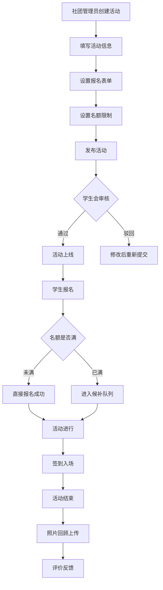
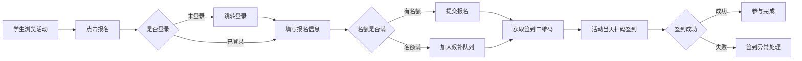
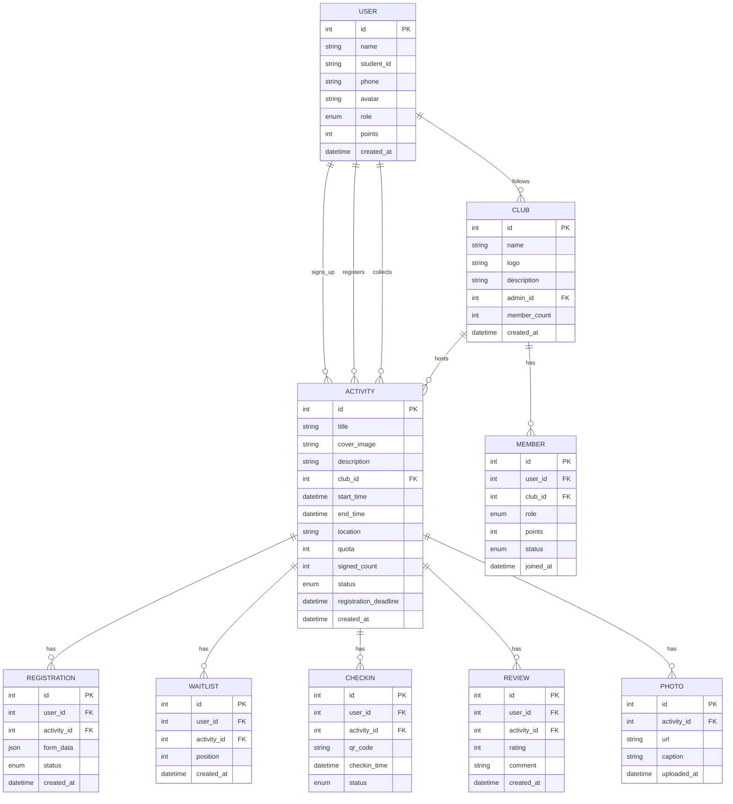

# 校园社团活动管理系统 - 产品需求文档

## 1. 产品概述

校园社团活动管理系统是一个面向大学生社团活动的综合性平台,为学生会和各社团提供活动发布、成员招募和参与统计的完整解决方案。系统连接社团管理者与普通学生,提升社团活动的组织效率和参与体验。

**核心价值:**
- 简化社团活动发布和管理流程
- 提高学生参与社团的便利性
- 提供数据化的活动参与统计分析
- 加强社团与学生之间的互动

**目标用户:**
- 学生:参与社团活动、管理个人参与记录
- 社团管理员:发布活动、管理成员、审核报名
- 学生会管理员:统筹管理、数据统计

---

## 2. 核心功能模块

### 2.1 用户角色

| 角色 | 注册方式 | 核心权限 |
|------|---------|---------|
| 学生 | 学号认证/手机号注册 | 浏览活动、报名参与、关注社团、收藏活动、查看参与记录 |
| 社团管理员 | 管理员授权 | 发布活动、管理报名、成员审核、签到管理、数据统计 |
| 学生会管理员 | 系统分配 | 全局管理、数据统计、活动审核、导出报表 |

### 2.2 功能模块

#### 2.2.1 首页
- **活动推荐区**:展示热门活动和最新活动,支持分类筛选
- **日历视图**:以日历形式展示活动日程,直观查看活动时间
- **社团推荐**:推荐优质社团,支持关注功能
- **快捷入口**:快速访问个人中心、报名管理等常用功能

#### 2.2.2 活动详情页
- **活动基本信息**:标题、时间、地点、主办社团、面向对象
- **活动介绍**:富文本活动详情说明
- **报名管理**:名额限制显示、实时剩余名额、报名截止时间
- **报名表单**:自定义报名字段(姓名、学号、联系方式、备注等)
- **候补排队**:名额满后自动进入候补队列,有名额时按顺序通知
- **签到二维码**:活动现场扫码签到,生成专属签到二维码
- **请假申请**:已报名学生可提交请假申请,管理员审核
- **照片回顾**:活动照片展示,营造活动氛围
- **评价反馈**:活动结束后学生对活动进行评分和文字评价

#### 2.2.3 社团主页
- **社团介绍**:社团名称、logo、简介、联系方式
- **关注功能**:学生可关注社团,关注后接收社团动态
- **活动列表**:社团举办的所有活动,按时间排序
- **成员管理**:社团管理员查看成员列表、积分记录、成员审核
- **社团公告**:发布社团最新通知

#### 2.2.4 报名管理页
- **报名表单自定义**:管理员自定义报名所需字段
- **报名名单导出**:支持Excel格式导出报名信息
- **候补队列管理**:查看和管理候补人员
- **签到管理**:扫码签到、查看已签到和未签到名单
- **未签到名单**:活动结束后显示未签到学生,便于后续跟进
- **报名趋势**:以图表形式展示报名人数变化趋势

#### 2.2.5 个人中心
- **个人信息**:头像、昵称、学号、联系方式等
- **参与记录**:我报名的活动、我参加的活动、我关注的社团
- **收藏活动**:收藏感兴趣的活动,方便下次查看
- **积分记录**:参与活动获得的积分,积分排行榜
- **活动提醒**:即将参加的活动提醒、社团动态通知
- **请假记录**:提交的请假申请及审核状态

---

## 3. 核心业务流程

### 3.1 活动发布流程



### 3.2 报名签到流程



---

## 4. 用户界面设计

### 4.1 设计风格

**设计理念**:青春活力、简洁现代、校园气息

**主色调**:
- 主色:深蓝色 #1E3A8A - 代表稳重和信任
- 辅助色:活力橙 #F97316 - 代表青春和活力
- 强调色:翠绿 #10B981 - 用于成功状态和积极提示
- 背景色:浅灰白 #F8FAFC - 清新明亮的视觉感受
- 文字色:#1E293B - 深灰色确保可读性

**字体选择**:
- 标题:思源黑体 Bold / Noto Sans SC Bold
- 正文:思源黑体 Regular / Noto Sans SC Regular
- 数字:DIN Alternate Bold - 用于统计数字展示

**按钮风格**:
- 主要按钮:圆角矩形,渐变背景,悬停放大效果
- 次要按钮:边框样式,透明背景
- 危险操作:红色警示样式

**布局风格**:
- 卡片式布局:活动卡片采用阴影和圆角设计
- 响应式导航:顶部导航栏,移动端汉堡菜单
- 网格系统:12列网格,灵活的间距设置

**图标风格**:
- 使用线性图标,统一线条粗细
- 重要操作配有图标说明
- 动画效果:悬停时的微动画,页面切换的过渡效果

### 4.2 页面设计概览

#### 首页设计
| 模块 | 布局 | 颜色 | 字体 | 动画效果 |
|------|------|------|------|---------|
| 顶部导航 | 固定顶部 | 白底深色文字 | 16px 正文 | 下拉阴影 |
| 搜索栏 | 居中大搜索框 | 渐变边框 | 18px | 聚焦时放大 |
| 分类筛选 | 横向标签栏 | 主色标签 | 14px | 选中时下划线动画 |
| 活动卡片 | 网格布局3列 | 白色卡片+阴影 | 标题18px Bold | 悬停上浮+阴影加深 |
| 日历视图 | 左侧边栏 | 主色日期 | 14px | 切换月份淡入淡出 |
| 社团推荐 | 横向滑动卡片 | logo+简介 | 16px | 悬停放大logo |

#### 活动详情页设计
| 模块 | 布局 | 颜色 | 字体 | 动画效果 |
|------|------|------|------|---------|
| 活动头图 | 全宽banner | 渐变遮罩 | 32px 白色 | 视差滚动 |
| 信息卡片 | 悬浮卡片 | 白底主色边框 | 16px | 固定右侧 |
| 报名按钮 | 底部悬浮 | 渐变主色 | 18px Bold | 脉冲动画(有名额时) |
| 二维码展示 | 弹窗/抽屉 | 白底 | 标题16px | 淡入缩放 |
| 照片墙 | 瀑布流布局 | 网格 | - | 懒加载淡入 |
| 评价区 | 卡片列表 | 头像+内容 | 14px | 滚动加载 |

#### 个人中心设计
| 模块 | 布局 | 颜色 | 字体 | 动画效果 |
|------|------|------|------|---------|
| 用户卡片 | 顶部大卡片 | 渐变背景 | 昵称24px | 头像悬停旋转 |
| 统计数据 | 四宫格 | 图标+数字 | 数字32px Bold | 数字滚动动画 |
| 功能菜单 | 列表布局 | 图标+文字 | 16px | 点击涟漪效果 |
| 活动记录 | 时间轴布局 | 主色节点 | 14px | 时间轴动画 |

### 4.3 响应式设计

- **桌面端(>1200px)**:完整布局,侧边栏导航,3列活动网格
- **平板端(768-1200px)**:收起侧边栏,2列活动网格,悬浮底部导航
- **移动端(<768px)**:汉堡菜单,单列布局,底部Tab导航

---

## 5. 数据模型

### 5.1 实体关系



### 5.2 主要数据表

#### 用户表(users)
```sql
CREATE TABLE users (
    id INT PRIMARY KEY AUTO_INCREMENT,
    name VARCHAR(50) NOT NULL,
    student_id VARCHAR(20) UNIQUE NOT NULL,
    phone VARCHAR(20),
    password_hash VARCHAR(255) NOT NULL,
    avatar VARCHAR(255),
    role ENUM('student', 'club_admin', 'admin') DEFAULT 'student',
    points INT DEFAULT 0,
    created_at TIMESTAMP DEFAULT CURRENT_TIMESTAMP
);
```

#### 社团表(clubs)
```sql
CREATE TABLE clubs (
    id INT PRIMARY KEY AUTO_INCREMENT,
    name VARCHAR(100) NOT NULL,
    logo VARCHAR(255),
    description TEXT,
    admin_id INT REFERENCES users(id),
    member_count INT DEFAULT 0,
    created_at TIMESTAMP DEFAULT CURRENT_TIMESTAMP
);
```

#### 活动表(activities)
```sql
CREATE TABLE activities (
    id INT PRIMARY KEY AUTO_INCREMENT,
    title VARCHAR(200) NOT NULL,
    cover_image VARCHAR(255),
    description TEXT,
    club_id INT REFERENCES clubs(id),
    start_time DATETIME NOT NULL,
    end_time DATETIME,
    location VARCHAR(200),
    quota INT DEFAULT 0,
    signed_count INT DEFAULT 0,
    status ENUM('pending', 'approved', 'rejected', 'finished') DEFAULT 'pending',
    registration_deadline DATETIME,
    created_at TIMESTAMP DEFAULT CURRENT_TIMESTAMP
);
```

#### 报名表(registrations)
```sql
CREATE TABLE registrations (
    id INT PRIMARY KEY AUTO_INCREMENT,
    user_id INT REFERENCES users(id),
    activity_id INT REFERENCES activities(id),
    form_data JSON,
    status ENUM('registered', 'checked_in', 'absent', 'leave_approved') DEFAULT 'registered',
    created_at TIMESTAMP DEFAULT CURRENT_TIMESTAMP,
    UNIQUE KEY unique_registration (user_id, activity_id)
);
```

---

## 6. 页面清单

| 页面 | 功能描述 | 优先级 |
|------|---------|--------|
| 首页 | 活动列表、分类筛选、日历视图、社团推荐 | P0 |
| 活动详情页 | 活动信息、报名、签到二维码、请假、照片、评价 | P0 |
| 社团主页 | 社团介绍、关注、活动列表、成员管理 | P0 |
| 报名管理页 | 报名表单、报名名单、候补队列、签到管理、数据统计 | P0 |
| 个人中心 | 个人信息、参与记录、收藏、积分、提醒 | P0 |

---

## 7. 验收标准

### 7.1 功能验收
- [ ] 用户可以浏览和筛选活动
- [ ] 用户可以报名参加活动,有名额限制和候补机制
- [ ] 活动签到二维码功能正常
- [ ] 请假申请和审核流程完整
- [ ] 社团关注和活动收藏功能正常
- [ ] 报名名单可导出
- [ ] 管理员可查看报名趋势和未签到名单
- [ ] 积分记录和排行榜功能正常

### 7.2 界面验收
- [ ] 页面加载流畅,无明显卡顿
- [ ] 动画效果流畅自然
- [ ] 响应式布局适配良好
- [ ] 色彩搭配协调统一
- [ ] 字体层级清晰可读

### 7.3 性能要求
- [ ] 首屏加载时间<3秒
- [ ] 页面切换流畅
- [ ] 图片懒加载正常
- [ ] 移动端操作流畅
