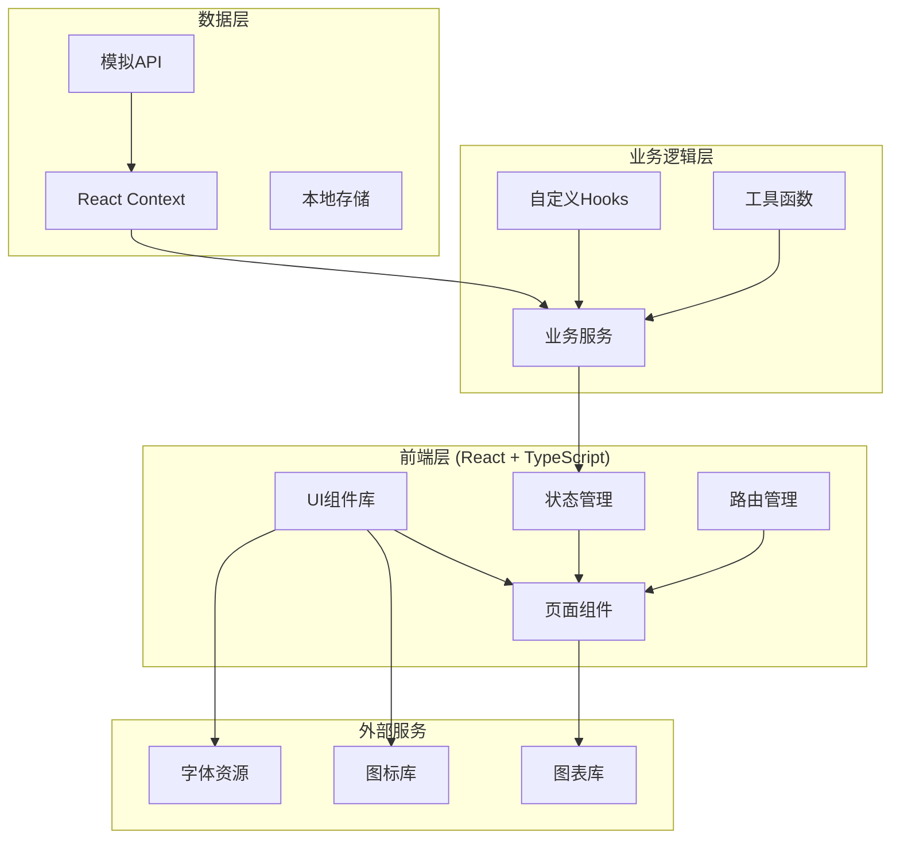
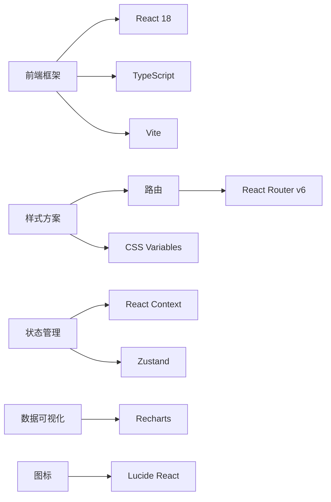

# 校园社团活动管理系统 - 技术架构文档

## 1. 架构设计

### 1.1 系统架构图



### 1.2 技术栈概览



---

## 2. 技术选型说明

### 2.1 前端框架
- **React 18**:函数式组件,Hooks API,高复用性
- **TypeScript**:类型安全,更好的开发体验
- **Vite**:快速热更新,优化的构建速度

### 2.2 样式方案
- **Tailwind CSS**:原子化CSS,快速开发,一致的样式系统
- **CSS Variables**:主题色管理,响应式断点

### 2.3 路由管理
- **React Router v6**:声明式路由,嵌套路由支持,懒加载

### 2.4 状态管理
- **React Context**:全局状态(用户信息、主题设置)
- **Zustand**:轻量级状态管理,替代Redux的简洁方案

### 2.5 数据可视化
- **Recharts**:React原生图表库,响应式,易于定制

### 2.6 图标库
- **Lucide React**:线性图标,风格统一,易于定制

### 2.7 工具库
- **date-fns**:日期处理
- **qrcode.react**:二维码生成
- **file-saver**:文件导出

---

## 3. 项目结构

```
campus-activities/
├── public/
│   ├── index.html
│   └── favicon.ico
├── src/
│   ├── assets/              # 静态资源
│   │   ├── images/
│   │   └── styles/
│   ├── components/           # 通用组件
│   │   ├── common/          # 通用UI组件
│   │   ├── layout/          # 布局组件
│   │   └── features/        # 功能组件
│   ├── pages/               # 页面组件
│   │   ├── Home/
│   │   ├── ActivityDetail/
│   │   ├── ClubPage/
│   │   ├── Registration/
│   │   └── Profile/
│   ├── services/            # 业务逻辑
│   │   ├── api.ts          # API请求封装
│   │   ├── activity.ts     # 活动相关服务
│   │   ├── club.ts         # 社团相关服务
│   │   └── user.ts         # 用户相关服务
│   ├── hooks/               # 自定义Hooks
│   │   ├── useActivities.ts
│   │   ├── useClubs.ts
│   │   └── useAuth.ts
│   ├── context/            # React Context
│   │   ├── AuthContext.tsx
│   │   └── ThemeContext.tsx
│   ├── data/               # 模拟数据
│   │   ├── activities.ts
│   │   ├── clubs.ts
│   │   └── users.ts
│   ├── types/              # TypeScript类型定义
│   │   └── index.ts
│   ├── utils/              # 工具函数
│   │   ├── format.ts
│   │   ├── storage.ts
│   │   └── validation.ts
│   ├── App.tsx
│   ├── main.tsx
│   └── index.css
├── package.json
├── tsconfig.json
├── vite.config.ts
├── tailwind.config.js
└── postcss.config.js
```

---

## 4. 路由定义

### 4.1 路由结构

| 路由路径 | 页面组件 | 权限要求 | 描述 |
|---------|---------|---------|------|
| / | HomePage | 公开 | 首页,活动列表 |
| /activity/:id | ActivityDetailPage | 公开 | 活动详情页 |
| /activity/:id/register | RegistrationForm | 已登录 | 活动报名表单 |
| /activity/:id/signin | SigninQRCode | 已登录 | 签到二维码 |
| /club/:id | ClubPage | 公开 | 社团主页 |
| /registration | RegistrationManagePage | 社团管理员 | 报名管理 |
| /registration/export | ExportPage | 社团管理员 | 导出报名名单 |
| /profile | ProfilePage | 已登录 | 个人中心 |
| /profile/activities | MyActivitiesPage | 已登录 | 我的活动 |
| /profile/clubs | MyClubsPage | 已登录 | 我的社团 |
| /profile/points | PointsPage | 已登录 | 积分记录 |
| /login | LoginPage | 公开 | 登录页 |

### 4.2 路由守卫

```typescript
// 路由守卫逻辑
const ProtectedRoute = ({ children, requireAdmin }) => {
  const { user, isAuthenticated } = useAuth();

  if (!isAuthenticated) {
    return <Navigate to="/login" replace />;
  }

  if (requireAdmin && user.role !== 'admin' && user.role !== 'club_admin') {
    return <Navigate to="/" replace />;
  }

  return children;
};
```

---

## 5. API 定义

### 5.1 活动相关接口

```typescript
// GET /api/activities - 获取活动列表
interface GetActivitiesRequest {
  page?: number;
  pageSize?: number;
  category?: string;
  status?: 'upcoming' | 'ongoing' | 'finished';
  clubId?: number;
  keyword?: string;
}

interface GetActivitiesResponse {
  activities: Activity[];
  total: number;
  page: number;
  pageSize: number;
}

// GET /api/activities/:id - 获取活动详情
interface GetActivityDetailResponse {
  activity: ActivityDetail;
  registrations: number;
  reviews: Review[];
  photos: Photo[];
}

// POST /api/activities - 创建活动 (需要社团管理员权限)
interface CreateActivityRequest {
  title: string;
  coverImage: string;
  description: string;
  clubId: number;
  startTime: string;
  endTime?: string;
  location: string;
  quota: number;
  registrationDeadline: string;
  formFields: FormField[];
}

interface CreateActivityResponse {
  activity: Activity;
  message: string;
}
```

### 5.2 报名相关接口

```typescript
// POST /api/activities/:id/register - 报名参加活动
interface RegisterRequest {
  formData: Record<string, string>;
}

interface RegisterResponse {
  success: boolean;
  registrationId?: number;
  position?: number; // 如果候补,返回候补位置
  message: string;
}

// GET /api/activities/:id/registrations - 获取报名列表 (管理员)
interface GetRegistrationsResponse {
  registrations: Registration[];
  checkedIn: number;
  notCheckedIn: number;
  waitlist: Waitlist[];
}

// POST /api/activities/:id/checkin - 签到
interface CheckinRequest {
  userId: number;
  qrCode: string;
}

interface CheckinResponse {
  success: boolean;
  checkinTime: string;
  message: string;
}

// POST /api/activities/:id/leave - 请假申请
interface LeaveRequest {
  reason: string;
}

interface LeaveResponse {
  success: boolean;
  status: 'pending' | 'approved' | 'rejected';
  message: string;
}
```

### 5.3 社团相关接口

```typescript
// GET /api/clubs - 获取社团列表
interface GetClubsResponse {
  clubs: Club[];
  total: number;
}

// GET /api/clubs/:id - 获取社团详情
interface GetClubDetailResponse {
  club: ClubDetail;
  activities: Activity[];
  members: Member[];
}

// POST /api/clubs/:id/follow - 关注社团
interface FollowClubResponse {
  success: boolean;
  followerCount: number;
}

// GET /api/clubs/:id/members - 获取社团成员 (管理员)
interface GetClubMembersResponse {
  members: Member[];
  pendingMembers: Member[];
}
```

### 5.4 用户相关接口

```typescript
// POST /api/auth/login - 用户登录
interface LoginRequest {
  studentId: string;
  password: string;
}

interface LoginResponse {
  user: User;
  token: string;
}

// GET /api/profile - 获取个人资料
interface GetProfileResponse {
  user: User;
  statistics: {
    activitiesJoined: number;
    clubsFollowed: number;
    points: number;
    rank: number;
  };
}

// GET /api/profile/activities - 获取参与活动
interface GetMyActivitiesResponse {
  upcoming: Activity[];
  completed: Activity[];
  cancelled: Activity[];
}

// GET /api/profile/points - 获取积分记录
interface GetPointsResponse {
  totalPoints: number;
  records: PointRecord[];
  rank: number;
}
```

---

## 6. 数据模型

### 6.1 核心实体类型

```typescript
// 用户类型
interface User {
  id: number;
  name: string;
  studentId: string;
  phone?: string;
  avatar: string;
  role: 'student' | 'club_admin' | 'admin';
  points: number;
  createdAt: string;
}

// 社团类型
interface Club {
  id: number;
  name: string;
  logo: string;
  description: string;
  adminId: number;
  memberCount: number;
  followerCount: number;
  isFollowed: boolean;
  createdAt: string;
}

// 活动类型
interface Activity {
  id: number;
  title: string;
  coverImage: string;
  description: string;
  clubId: number;
  clubName: string;
  clubLogo: string;
  startTime: string;
  endTime?: string;
  location: string;
  quota: number;
  signedCount: number;
  status: 'pending' | 'approved' | 'rejected' | 'ongoing' | 'finished';
  registrationDeadline: string;
  isRegistered: boolean;
  isCollected: boolean;
  category: string;
  tags: string[];
  createdAt: string;
}

// 活动详情
interface ActivityDetail extends Activity {
  formFields: FormField[];
  reviews: Review[];
  photos: Photo[];
  statistics: {
    averageRating: number;
    totalReviews: number;
    checkinRate: number;
  };
}

// 报名记录
interface Registration {
  id: number;
  userId: number;
  userName: string;
  userAvatar: string;
  activityId: number;
  formData: Record<string, string>;
  status: 'registered' | 'checked_in' | 'absent' | 'leave_approved';
  checkinTime?: string;
  createdAt: string;
}

// 候补记录
interface Waitlist {
  id: number;
  userId: number;
  userName: string;
  activityId: number;
  position: number;
  createdAt: string;
}

// 评价
interface Review {
  id: number;
  userId: number;
  userName: string;
  userAvatar: string;
  activityId: number;
  rating: number;
  comment: string;
  createdAt: string;
}

// 活动照片
interface Photo {
  id: number;
  activityId: number;
  url: string;
  caption?: string;
  uploadedAt: string;
}

// 社团成员
interface Member {
  id: number;
  userId: number;
  userName: string;
  userAvatar: string;
  clubId: number;
  role: 'member' | 'admin';
  points: number;
  status: 'active' | 'pending' | 'removed';
  joinedAt: string;
}

// 积分记录
interface PointRecord {
  id: number;
  userId: number;
  activityId?: number;
  clubId?: number;
  points: number;
  type: 'earn' | 'spend';
  description: string;
  createdAt: string;
}

// 表单字段
interface FormField {
  id: string;
  type: 'text' | 'number' | 'select' | 'textarea';
  label: string;
  required: boolean;
  options?: string[]; // for select type
  placeholder?: string;
}
```

---

## 7. 模拟数据策略

### 7.1 数据初始化

由于本项目使用前端Mock数据,将在以下文件中提供完整的示例数据:

- `src/data/activities.ts`:30+个活动数据,涵盖不同类型
- `src/data/clubs.ts`:10+个社团数据
- `src/data/users.ts`:用户和社团管理员数据
- `src/data/registrations.ts`:报名和签到数据

### 7.2 数据持久化

- 使用 `localStorage` 存储用户操作数据
- 使用 `Context` 管理全局状态
- 模拟API延迟(200-500ms)提升真实感

### 7.3 状态管理方案

```typescript
// 使用Zustand进行状态管理
import { create } from 'zustand';
import { persist } from 'zustand/middleware';

interface AppState {
  user: User | null;
  activities: Activity[];
  clubs: Club[];
  registrations: Registration[];
  collectedActivities: number[];
  followedClubs: number[];

  // Actions
  setUser: (user: User | null) => void;
  registerActivity: (activityId: number, formData: Record<string, string>) => void;
  collectActivity: (activityId: number) => void;
  followClub: (clubId: number) => void;
  checkin: (activityId: number, userId: number) => void;
}

export const useStore = create<AppState>()(
  persist(
    (set, get) => ({
      // ... state and actions
    }),
    {
      name: 'campus-activities-storage',
    }
  )
);
```

---

## 8. 性能优化策略

### 8.1 代码分割

```typescript
// 使用React.lazy进行路由级别的代码分割
const HomePage = lazy(() => import('./pages/Home'));
const ActivityDetailPage = lazy(() => import('./pages/ActivityDetail'));
const ClubPage = lazy(() => import('./pages/ClubPage'));
```

### 8.2 图片优化

- 使用 `loading="lazy"` 属性实现图片懒加载
- 提供适当的图片尺寸
- 使用WebP格式(如果支持)

### 8.3 缓存策略

- 使用 `React.memo` 缓存组件
- 使用 `useMemo` 缓存计算结果
- 使用 `useCallback` 缓存回调函数

---

## 9. 部署方案

### 9.1 构建配置

```bash
# 使用Vite构建
npm run build

# 输出目录: dist/
# 部署到静态服务器或CDN
```

### 9.2 环境变量

```typescript
// .env.production
VITE_API_BASE_URL=https://api.example.com
VITE_APP_TITLE=校园社团活动管理系统
```

---

## 10. 开发规范

### 10.1 命名规范

- **组件名**: PascalCase (如: `ActivityCard`)
- **文件命名**: PascalCase for components, camelCase for others
- **CSS类名**: kebab-case with Tailwind utilities
- **常量**: UPPER_SNAKE_CASE

### 10.2 代码风格

- 使用函数式组件和Hooks
- 所有组件使用TypeScript类型
- Props使用interface定义
- 使用可选链和空值合并运算符
- 避免使用any类型

### 10.3 Git提交规范

```
feat: 新功能
fix: 修复bug
docs: 文档更新
style: 代码格式调整
refactor: 重构
test: 测试相关
chore: 构建或辅助工具更新
```

---

## 11. 技术风险与应对

| 风险 | 等级 | 应对措施 |
|------|------|---------|
| 二维码扫描兼容性 | 中 | 使用原生API+兼容性库 |
| 大量活动数据渲染性能 | 中 | 虚拟滚动+分页加载 |
| 移动端手势冲突 | 低 | 测试多种设备,优化交互 |
| 状态管理复杂性 | 低 | 清晰的模块划分+文档 |

---

## 12. 后续扩展

### 12.1 可选功能(Phase 2)

- 即时通讯功能
- 活动直播
- 在线投票
- 社团经费管理
- 多语言支持

### 12.2 后端迁移

当前使用Mock数据,后续可轻松迁移到真实后端:
- 替换 `src/services/` 中的Mock实现
- 使用相同的接口定义
- 添加身份验证Token处理

---

*文档版本: 1.0*
*创建日期: 2026-06-14*
*最后更新: 2026-06-14*
